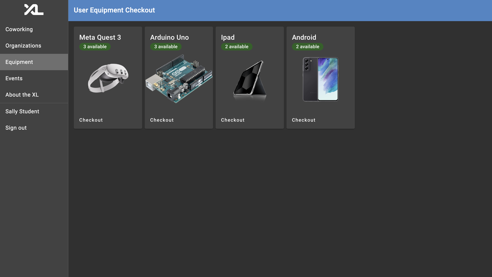
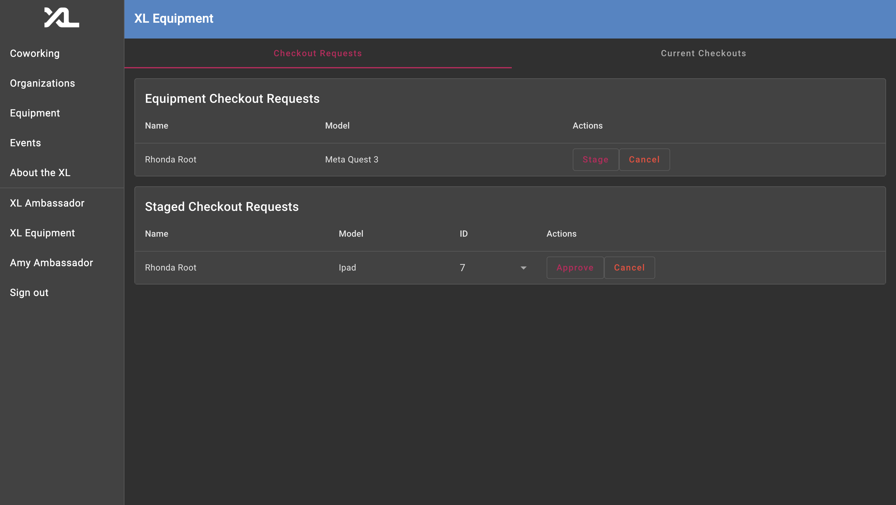

# Equipment Reservation Technical Specification Documentation

## #1: Descriptions and sample data representations of new or modified model representation(s) and API routes supporting your feature’s stories

### Authors

- Jacob Brown
  * https://github.com/jacbro2021
- Nicholas Mountain
  * https://github.com/nicholasmountain11
- Ayden Franklin
  * https://github.com/aydenpf
- David Sprague
  * https://github.com/davids122

### Personas & Images

#### Sally Student

When Sally Student navigates to the Equipment tab on the left sidebar, Sally will see cards representing all of the currently available equipment, as well as the number of equipment items for each type that are available. If Sally has already filled out the wavier, then Sally can click the checkout button to submit a checkout request for a given type of equipment. Otherwise, Sally will be navigated to the wavier page to fill out the wavier before continuing with the checkout process.

If a student attempts to checkout an item and they have never filled out the wavier before, they will be automatically navigated to this page. The student will need to sign their name in the text box before continuing. Once the student has signed the wavier, they are navigated back to the Equipment page to select they equipment they would like to make a request for. 

#### Amy Ambassador

When Amy Ambassador navigates to the XL Equipment tab on the left sidebar, they will see the Equipment Checkout Requests table as well as the Staged Checkout Requests table. Amy Ambassador can move a checkout request to the staged request table by hitting the "stage" button. This is intended to be done when Amy is about to select the equipment item and give it to the person checking it out. After Amy gives the item to the student, Amy clicks the approve button which sends the item to the Current Checkouts tab in the top right (see next image).

Amy Ambassador can view all of the currently checked out items in the Current Checkouts tab. Amy can also view the model, id, due date, and the name of the person with the item checked out for every checkout in this table. When a user returns their equipment, Amy will select the return button on this page to finalize the return. 

### Models

[New: Equipment Checkout Request Model Permalink](https://github.com/comp423-23f/csxl-final-team-d9/blob/d304096272b3f7eee05019938bc392cc9889ad48/backend/models/equipment_checkout_request.py#L11-L21)

This is a new model to represent a request to check out a piece of equipment. Request is made by the user and approved by the ambassador.

[Changed: Equipment Model](https://github.com/comp423-23f/csxl-final-team-d9/blob/d304096272b3f7eee05019938bc392cc9889ad48/backend/models/equipment.py#L23-L24)

Added condition notes array and checkout history array that will eventually store a list of PIDs.

[Changed: User Model](https://github.com/comp423-23f/csxl-final-team-d9/blob/d304096272b3f7eee05019938bc392cc9889ad48/backend/models/user.py#L39)

Added has_signed_waiver field to user model to track whether they have signed the equipment liability wavier.

### API Routes

[New: /add_request](https://github.com/comp423-23f/csxl-final-team-d9/blob/d304096272b3f7eee05019938bc392cc9889ad48/backend/api/equipment/checkout.py#L95-L122)

This new API route allows a user to create and add an equipment checkout request to backend database.

[New: /get_all_requests](https://github.com/comp423-23f/csxl-final-team-d9/blob/d304096272b3f7eee05019938bc392cc9889ad48/backend/api/equipment/checkout.py#L155-L170)

This new API route allows an ambassador to view all equipment checkout requests.

[New: /delete_request](https://github.com/comp423-23f/csxl-final-team-d9/blob/d304096272b3f7eee05019938bc392cc9889ad48/backend/api/equipment/checkout.py#L126-L151)

This allows an ambassador to delete a users equipment checkout request to either approve or cancel the request.

[New: /get_all_for_request](https://github.com/comp423-23f/csxl-final-team-d9/blob/d304096272b3f7eee05019938bc392cc9889ad48/backend/api/equipment/checkout.py#L174-L191)

This allows an ambassador to see all of the available equipment that can be checked out for a certain equipment type. This is necessary for selecting an item to be checked out for an equipment checkout request.

[New: /update_waiver_field](https://github.com/comp423-23f/csxl-final-team-d9/blob/d304096272b3f7eee05019938bc392cc9889ad48/backend/api/equipment/checkout.py#L195-L215https://github.com/comp423-23f/csxl-final-team-d9/blob/d304096272b3f7eee05019938bc392cc9889ad48/backend/api/equipment/checkout.py#L195-L215)

This allows a user to update their has_signed_waiver field after signing waiver.

## Underlying database/entity-level representation decisions

We have created two new entities with corresponding tables: Equipment and EquipmentCheckoutRequest. We needed an equipment entity because we need to sotre each individual piece of equipment. We decided to include an array to store notes about the condition of the equipment. An ambassador will eventually be able to evaluate condition of equipment upon return. Additionally, we needed an eqiupment checkout request entity to appropriately manage users requests for equipment checkouts. Each equipment checkout request has a model field. We decided to do this rather than having a specific piece of equipment tied to the request so that an ambassador can select the piece of equipment that will be checked out.

There are four new entity/model pairings for the equipment reservation feature, Equipment, EquipmentCheckoutRequest, StagedCheckoutRequest, and EquipmentCheckout.

Starting with Equipment, there is an _EquipmentEntity_ that encapsulates information about each specific item of equipment in the CSXL inventory. The entity specifies the unique equipment_id, model name ('type of equipment'), image, condition, checkout status, notes on condition, and a history of students who have checked it out. Currently, the condition, condition notes, and checkout history are not used. In the future, these properties should be used to help admin manage equipment, and to hold users accountable for consistent irresponsibility with equipment.

Next, there is an _EquipmentCheckoutRequestEntity_ that is created once a user attempts to checkout an item of equipment. All checkout requests will be sent to a CSXL ambassador to be approved. This entity stores the name of the user requesting the equipment, said user's PID, the model of the requested equipment. A specific item of equipment is not stored with the checkout to give the ambasador the responsibilty of selecting an appropriate item of based off of condition.

There is a _StagedCheckoutRequestEntity_ that is created when an ambassador presses the "Stage" button on the checkout request. When this happens, the ambassador will retrieve the equipment item from the CSXL inventory, select the equipment_id of the selected equipment, and approve the checkout when the user is given their equipment. For this functionality, the entity stores the name of the user checking out the equipment, the model name of the equipment, the pid of the user, and a list of the IDs of all available equipment of the desired model.

There is an _EquipmentCheckoutEntity_ that is created when an ambassador succesfully approves a staged checkout request. The entity stores the user name and PID of the user who checked out the item, the ID and model of the specific equipment item, status of the checkout (active or returned), and the dates of the start and end of the checkout period. The end time defaults to 3 days after the start time as a due date, and upon return is updated to the time of return. Returned checkouts stay in the database even though they are not currently used. Future features can query returned checkouts to gather information as needed.

## Technical and User Design Choices

#### Separate Data Tables for Various Phases of a Checkout:

There are seperate data representations for checkout requests, staged checkout requests, and checkouts rather than having them be the same model/entity and having status fields (request, staged, checked_out, returned). This allows for easy differentiation between checkouts that are pending, staged, and confirmed. In the future, ambassadors may be able to view past checkouts, and information about requests would be not needed.

#### User Experience Design Choice

For the ambassador view there is a table containing "staged checkouts". This is used to show checkouts that are in the process of being confirmed by the ambassador (ambassador is physically going to get the device and then selecting corresponding ID). This approach was preferred over directly confirming checkouts to allow the ambassador to "stage" a request, physically look at equipment that is available, choose an item of equipment, and select this item on the application. This gives the ambassador control over what item of equipment is being checked out to guarantee users recieve the best available equipment.

## Getting Started

#### Frontend

- Equipment Module: This declares each component, widget, and the service related to equipment feature. This module imports any angular material components/modules used for the feature.
- User-Equipment Component: This contains the equipment card widgets for each equipment type. Calls the equipment service, which in turn calls the API route for getting all equipment_types.
- Equipment Card Widget: This widget displays equipment type information including model, picture, and number available.
- Equipment Type Model: Model to format data recieved from the backend such that it can be displayed in the equipment card widget. 
- Ambassador Component: This component contains the checkout request card, staged checkout request card widgets, and checkout cards. The display is tabbed into two sections, the left containing pending checkouts (checkout requests and staged requests), the right containing confirmed, active checkouts.
- Checkout request card: This displays all checkout request that have been made by users. There is a button to "Stage" the request, which creates a staged checkout request, and a button to "Cancel" the request, which removes the request from the view and the database.
- Staged checkout request card: This widget displays all staged checkout requests. Ambassador can select a piece of equipment by it's ID in this table. The IDs are chosen from a dropdown list. To the right of that, is a button to "Approve" the checkout, which creates a checkout, and a button to "Cancel" the staged checkout, which removes it from the view and the database.
- Checkout card: This widget displays all confirmed, active checkouts. Ambassador can press the "Return" button to return the checkouts when the user brings them back to the CSXL.
- Waiver Component: This component displays a fake waiver and requires an input to the signiture field. It is only routed to if the user has not yet signed the waiver. After submission, it routes back to the user equipment component.
- EquipmentCheckoutConfirmationComponent: Confirms that a user has requested an equipment checkout request.
- EquipmentService: Communicates with the backend, to control everything that the frontend needs to know to manage the creation and confirmation of checkout requests.
- Equipment Model: defines the layout of data retrieved from the Equipment service API.
- Checkout Request Model: Defines the format of the data that is presented in the checkout request card.
- Staged Checkout Request Model: Defines the format of the data that is presented in the staged checkout request card. When checkout requests are "staged", the checkout request data is converted into a staged checkout request model. 

#### Backend

- Entities: 
  * Equipment Entity: Stores data about a specific piece of equipment.
  * Checkout Request Entity: Stores data about a checkout request made by a user.
  * Staged Checkout Request Entity: Persists data for the stage table in the frontend.
  * Checkout Entity: Persists data for currently checked out equipment items. 
- Equipment Service: Handles all the logic for manipulating the database, called by the api routes.
- user_equipment_tests: Tests all methods in the equipment service.
- API Routes: Calls equipment service methods to communicate data changes and logic to and from the frontend.
- user_equipment_data: Stores and inserts mock data for equipment, fake requests, and permissions.
